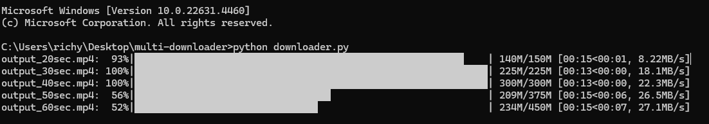

# File Downloader

A robust Python script designed to download multiple files concurrently with support for resumable downloads, error handling, and retry mechanisms. The program ensures reliable operation by saving progress to temporary files, allowing it to resume downloads even if the program itself is restarted.

---

## **Features**

- **Parallel Downloads**  
  Utilizes `ThreadPoolExecutor` to download multiple files simultaneously, configurable via `MAX_WORKERS`.

- **Resumable Downloads**  
  Automatically resumes interrupted downloads by checking the file's existing size and using HTTP `Range` headers.

- **Error Handling and Retry Mechanism**  
  - Handles network and server errors with automatic retries.
  - Verifies internet connectivity before retrying downloads.

- **Progress Visualization**  
  Displays progress bars for each file download using the `tqdm` library.

- **Restart Resilience**  
  Downloads are saved in a temporary directory, ensuring progress is not lost if the program is restarted.

---

## **Installation**

1. Clone the repository or download the script.
2. Install the required Python packages:

   ```bash
   pip install -r requirements.txt
   ```

---

## **Key Parameters (Editable in the Script)**

- **DOWNLOAD_DIR**  
  Directory where completed downloads are saved.  
  *Default*: `downloads`.

- **TEMP_DIR**  
  Temporary directory to store partial downloads.  
  *Default*: `temp`.

- **RETRY_DELAY**  
  Delay (in seconds) between retry attempts.  
  *Default*: `5`.

- **MAX_RETRIES**  
  Maximum number of retries for failed downloads.  
  *Default*: `10`.

- **MAX_WORKERS**  
  Number of concurrent downloads.  
  *Default*: `5`.

- **SAFE_URL**  
  URL used to check internet connectivity.  
  *Default*: `https://www.google.com`.

- **LOG_FILE**  
  Log file for recording errors and progress.  
  *Default*: `download.log`.

---

## **Usage**

1. **Define the list of URLs**  
   Modify the `URLS` variable in the script:

   URLS = [  
       "https://example.com/file1.mp4",  
       "https://example.com/file2.zip",  
       "https://example.com/file3.pdf",  
   ]

2. **Run the script**  
   Use the following command to execute the script:
    
    ```bash
   python downloader.py
   ```

3. **Monitor progress**  
   Real-time progress bars for each file will be displayed in the console.

4. **Check output**  
   Completed files will be saved in the `downloads` directory.  
   Detailed logs, including errors and retries, can be found in the `download.log` file.

---

## **How It Works**

### **Resumable Downloads**

- The script checks the size of partially downloaded files in the `TEMP_DIR` directory.  
- If a partial file exists, it resumes the download from where it stopped using HTTP `Range` headers.

### **Restart Resilience**

- If the script is stopped (e.g., system reboot or crash), it resumes downloads automatically upon the next execution.

### **Error Handling and Retry Mechanism**

- Handles network interruptions and server-side errors.  
- Automatically retries downloads up to `MAX_RETRIES` times, waiting `RETRY_DELAY` seconds between attempts.

---

## **Log File**

- A detailed log of all activities, including successful downloads, errors, and retry attempts, is stored in the `download.log` file.  
- This file is useful for debugging and tracking download progress.

---

## **Example Output**

When running the script, you'll see progress bars for each download:

```bash
file1.mp4: 30%|█████████████                     | 12.0M/40.0M
```



## **Future Improvements**

### **Integration with a Web Framework**
- The script could be enhanced by integrating it into a web framework like **Django** or **Flask**.
- Features to include:
  - A **user-friendly dashboard** to manage downloads.
  - Real-time progress updates displayed in the browser using WebSockets.
  - Secure user authentication to restrict access to downloads.

### **Environment Variables**
- Replace hardcoded parameters (e.g., `DOWNLOAD_DIR`, `TEMP_DIR`, `MAX_WORKERS`) with **environment variables**.
- Benefits:
  - Easier configuration for different environments (development, production).
  - Enhanced security for sensitive information.

### **Download Scheduling**
- Add a feature to schedule downloads at specific times.
- Useful for bandwidth management during off-peak hours.

### **Pause and Resume via Panel**
- Implement a web-based control panel to **pause, resume, or cancel downloads** dynamically.
- Provide a detailed overview of current and completed downloads, with options to retry failed downloads.

### **Multi-User Support**
- Extend functionality for multiple users to manage their own downloads.
- Use unique directories and logs for each user.

These improvements would transform the script into a comprehensive and versatile download management system.

## **License**

This project is licensed under the **MIT License**.  
You are free to use, modify, and distribute this software, provided the original license file is included in your distribution.  

For full license details, see the [LICENSE](LICENSE) file included in this repository.
